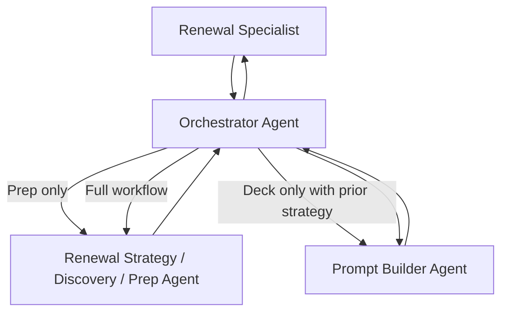

# Agent Interactions

## Interaction Model
The Orchestrator Agent is the only user-facing entry point. Worker agents do not interact with the user directly.

## Request Lifecycle

### 1. Intent Classification
The orchestrator classifies each request into exactly one intent.

1. Full workflow
2. Deck only (requires prior strategy output in conversation)
3. Call preparation only
4. Unclear intent (single clarifying question)

### 2. Required Input Gating
Before invoking worker agents, the orchestrator must verify required inputs are present.

- Required: Customer Intelligence Report
- Optional enrichers: stakeholder context, known concerns, meeting context, prior notes

If required input is missing, the orchestrator asks once and waits.

### 3. Agent Invocation Patterns
- Call preparation only: invoke Strategy/Discovery/Prep Agent and return output unchanged.
- Deck only: invoke Prompt Builder with Customer Intelligence Report plus prior strategy output.
- Full workflow: invoke Strategy/Discovery/Prep Agent first, then Prompt Builder with both required artifacts.

### 4. Error and Retry Behavior
If a worker response is empty, errored, or clearly incomplete:

1. Orchestrator does not synthesize missing content.
2. Orchestrator reports the issue and offers retry or input adjustment.
3. Retry path reuses the same context unless user provides updates.

### 5. Follow-Up Modification Handling
For user refinements, re-invoke the appropriate worker agent with:

1. Original context
2. Prior relevant output
3. User's new constraints

## Handoff Contracts

### Orchestrator -> Strategy/Discovery/Prep
- Full unmodified Customer Intelligence Report
- Optional user context
- Any explicit user constraints

### Orchestrator -> Prompt Builder
- Full unmodified Customer Intelligence Report
- Complete strategy output from current conversation
- Any deck-specific constraints

### Worker -> Orchestrator
- User-ready output only
- No internal schemas, processing traces, or hidden reasoning artifacts

## Shared Reusable Prompt Patterns
Use these as common building blocks across agent prompts to reduce duplication.

1. Source-priority rule block (authoritative data ordering)
2. Unknown-handling language (neutral, non-speculative)
3. Prohibited behavior block (pricing/discounting/negotiation/deep implementation)
4. Output contract block (exact allowed output type)
5. Conflict-resolution rule (higher-priority source wins)

### Canonical Source Priority Block
Use this exact pattern when prompts reference source precedence.

1. Customer Intelligence Report (authoritative for tenant usage and licensing context)
2. Current agreement artifacts
3. Internal sales guidance
4. Compliance reference guidance
5. Public web verification (limited to institution context; never tenant usage/licensing inference)

Conflict rule: higher-priority source prevails, uncertainty is stated neutrally, and missing facts are never invented.

## Architectural Drift Checks
Run this checklist for any significant prompt or architecture change.

1. Capability Ownership
- Which agent owns the capability now?
- Is ownership newly duplicated?

2. Contract Compatibility
- Did required inputs change?
- Did output shape or downstream dependency change?

3. Reuse and Duplication
- Was shared logic introduced once or copied across prompts?
- Should the logic move to a shared pattern section?

4. Operational Risk
- Could routing behavior regress?
- Could user-visible consistency regress?

5. Governance Updates
- Were architecture docs, evaluations, and release notes updated together?

## Minimum Scenario Walkthroughs
Use these baseline scenarios after any significant change.

1. Prep only request with complete Customer Intelligence Report.
2. Deck only request with prior strategy output available.
3. Full workflow request without prior strategy output.

