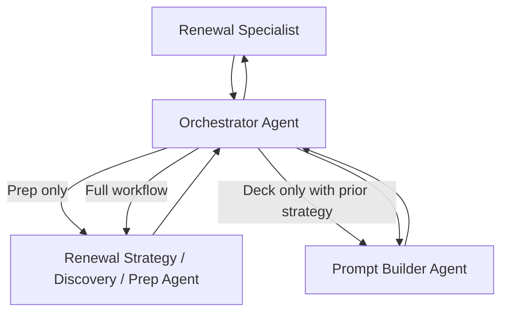

# Agent Interactions

## Interaction Model
The Orchestrator Agent is the only user-facing entry point. Worker agents do not interact with the user directly.

```mermaid
flowchart TD
    U[Renewal Specialist] --> O[Orchestrator Agent]
    O -->|Prep only| S[Renewal Strategy / Discovery / Prep Agent]
    O -->|Deck only with prior strategy| P[Prompt Builder Agent]
    O -->|Full workflow| S
    S --> O
    O --> P
    P --> O
    O --> U
```

## Request Lifecycle

### 1. Intent Classification
The orchestrator classifies each request into exactly one intent.

1. Full workflow
2. Deck only (requires prior strategy output in conversation)
3. Call preparation only
4. Unclear intent (single clarifying question)

### 2. Required Input Gating
Before invoking worker agents, the orchestrator must verify required inputs are present.

- Required: Customer Intelligence Report
- Optional enrichers: website URL, stakeholder context, known concerns, meeting context, prior notes, supplied education segment, explicit seller ETC confirmation

If required input is missing, the orchestrator asks once and waits.

Reuse context already supplied for the current account without asking for the same CIR again. A report or strategy for a different account is not reusable context for the new account. Keep seller corrections and concerns separate from the unmodified CIR, and pass the seller's exact ETC statement; an inquiry is not confirmation. Missing optional context does not introduce another mandatory gate.

### 3. Agent Invocation Patterns
- Call preparation only: invoke Strategy/Discovery/Prep Agent and return output unchanged.
- Deck only: invoke Prompt Builder with Customer Intelligence Report plus prior strategy output.
- Full workflow: invoke Strategy/Discovery/Prep Agent first, then Prompt Builder with both required artifacts.

### 4. Error and Retry Behavior
If a worker response is empty, errored, or clearly incomplete:

1. Orchestrator does not synthesize missing content.
2. Orchestrator reports the issue and offers retry or input adjustment.
3. Retry path reuses the same context unless user provides updates.

Check the visible output contract without rewriting worker content. Strategy must supply its three sections; Prompt Builder must supply one PowerPoint prompt without internal artifacts. Explicit unknowns and no confirmed resource are valid responses, not incompleteness.

If Strategy fails during full workflow, stop before Prompt Builder. If only Prompt Builder fails, retain the successful Strategy output and retry the failed worker only when the user authorizes it. Do not automatically retry, pass partial strategy downstream, or claim a completed deck after a failure.

### 5. Follow-Up Modification Handling
For user refinements, re-invoke the appropriate worker agent with:

1. Original context
2. Prior relevant output
3. User's new constraints

Resource criteria, growth recommendations, and seller-confirmation updates go to Strategy. Presentation-only refinements go to Prompt Builder. When an updated deck is also requested, invoke Prompt Builder after Strategy and pass the updated complete output; never qualify a resource in the Orchestrator or Prompt Builder.

## Handoff Contracts

### Orchestrator -> Strategy/Discovery/Prep
- Full unmodified Customer Intelligence Report
- Website URL if supplied and all optional user context, including segment and explicit seller confirmation
- Any explicit user constraints

### Orchestrator -> Prompt Builder
- Full unmodified Customer Intelligence Report
- Complete strategy output from current conversation
- Website URL if supplied and all optional context, including segment and explicit seller confirmation
- Any deck-specific constraints

### Worker -> Orchestrator
- User-ready output only
- No internal schemas, processing traces, or hidden reasoning artifacts

### Strategy Output -> Prompt Builder
Strategy returns exactly:
1. Sales Pitch Strategy, including recommended next steps.
2. Tailored Discovery Questions.
3. Available Resources, replacing the former internal Prep Brief.

Resource entries distinguish evidenced purpose, minimum-criteria status, missing validation, and next action. ETC confirmation comes from the seller, not threshold logic. Partner content remains a generic seller reference.

Strategy connects each recommendation to a confirmed signal, a customer outcome, and a validation-focused action. Fewer than two growth areas may be appropriate. A conservative Strategy B default with insufficient evidence is a discovery narrative, not proof of a capability gap. Unknown security readiness is neither a readiness finding nor an insecurity finding.

Assessment evidence should show the relevant CIR quantity beside its threshold; do not aggregate unrelated populations or equate active Copilot users with purchased licenses. Identical Master Class minimums do not justify recommending both; customer purpose must support the choice. Discovery should address unresolved facts without embedding unverified deficiencies.

Prompt Builder consumes this report without requiring a separate prep brief. Assessments need Strategy-supported minimum criteria before customer resource actions are included; uncertain availability leads to a confirmation action, not a delivery promise. ETC actions require seller-confirmed eligibility in Strategy. Only customer-appropriate actions appear on Slide 5; omit internal status notes and partner reminders from slides and presenter notes. No qualifying resource means ordinary evidence-based discovery/adoption next steps, not a fabricated alternative.

The shared approved education template supports K-12 districts, universities, and community colleges. The five-slide contract and existing required field shapes are retained. Copilot expansion never establishes security readiness.

Prompt Builder maps supported content into the existing slides without selecting a new product or changing eligibility. Unknown availability supports a confirmation action, not a delivery commitment. Its final internal check covers customer-safe source notes, all required fields, and the absence of fabricated use cases, metrics, timelines, stakeholders, or resources. These checks add no visible section or internal reasoning to the output.

### Compatibility and Validation Status
Section 3 has changed meaning despite the unchanged section count. Consumers expecting a Prep Brief must adopt the new contract. Historical Strategy outputs lack the new resource evidence; do not invent it. Refresh seller preparation under the new prompt when resources are needed.

No fiscal-guidance handoff or required timing field is added. Runtime evaluations and their assets are paused, not passing; repository static checks do not validate orchestration in Copilot Studio.

## Shared Reusable Prompt Patterns
Use these as common building blocks across agent prompts to reduce duplication.

1. Source-priority rule block (authoritative data ordering)
2. Unknown-handling language (neutral, non-speculative)
3. Prohibited behavior block (pricing/discounting/negotiation/deep implementation)
4. Output contract block (exact allowed output type)
5. Conflict-resolution rule (higher-priority source wins)

### Canonical Source Priority Block
Use this exact pattern when prompts reference source precedence.

1. Customer Intelligence Report (authoritative for tenant usage and licensing context)
2. Current agreement artifacts
3. Internal sales guidance
4. Compliance reference guidance
5. Public web verification (limited to institution context; never tenant usage/licensing inference)

Conflict rule: higher-priority source prevails, uncertainty is stated neutrally, and missing facts are never invented.

## Architectural Drift Checks
Run this checklist for any significant prompt or architecture change.

1. Capability Ownership
- Which agent owns the capability now?
- Is ownership newly duplicated?

2. Contract Compatibility
- Did required inputs change?
- Did output shape or downstream dependency change?

3. Reuse and Duplication
- Was shared logic introduced once or copied across prompts?
- Should the logic move to a shared pattern section?

4. Operational Risk
- Could routing behavior regress?
- Could user-visible consistency regress?

5. Governance Updates
- Were architecture docs, evaluations, and release notes updated together?

## Minimum Scenario Walkthroughs
Use these baseline scenarios after any significant change.

1. Prep only request with complete Customer Intelligence Report.
2. Deck only request with prior strategy output available.
3. Full workflow request without prior strategy output.

